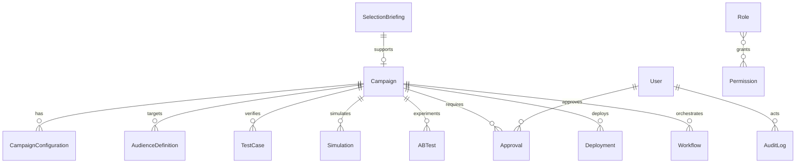
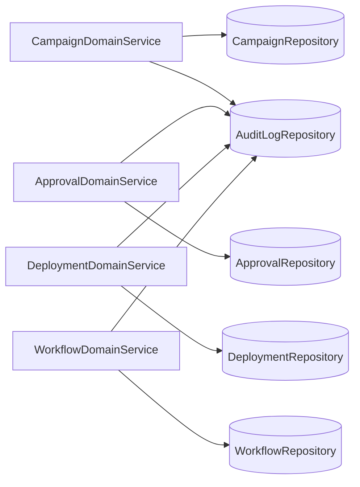

# Domain Model (Phase 2)

This document defines the Domain-Driven Design model for CVM Catalyst Phase 2.

## Bounded Contexts

- Campaign Management
- Audience and Experimentation
- Governance and Access Control
- Workflow and Deployment

## Aggregate Roots

- Campaign
- SelectionBriefing
- User
- Workflow

## Entity Relationship Diagram

## Domain Service Interaction

## Notes

- Business-specific rules are intentionally not embedded at this stage.
- Services coordinate state transitions and auditing only.
- Repository interfaces define persistence ports for infrastructure adapters.
